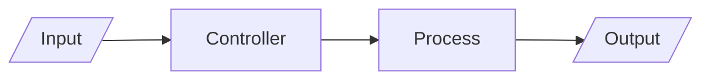
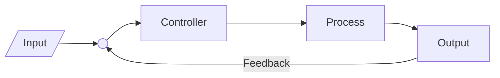
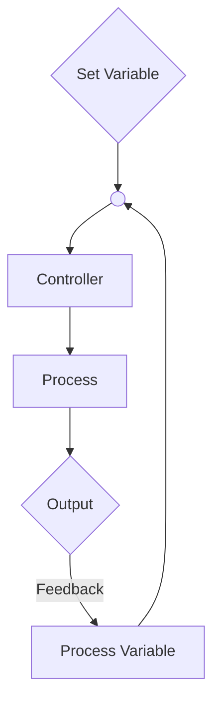

--**Created:** Wed 4th January 2023 14:52
[[zk/BTEC Nationals Information Technology (2010)]] Unit 24

---

# Control Loops
## Open Loop

- Output has no bearing on the system
- Error needs to be accounted for by the user
	- Acquired knowledge
- Example: Space Heater - keeps running until switched off and cannot monitor output
- Less complicated, less cost

## Closed Loop

- Output is fed fed back into the controller
- Able to correct for error
- More accurately able to achieve desired input
- Example: boiler/hvac that can turn on/modify process depending on room temperature and comparing it to input (desired temp)
- More complicated, more cost

# Proportional Control

---
# References & Further Reading

Control Systems Lectures:
https://www.youtube.com/playlist?list=PLBlnK6fEyqRhqzJT87LsdQKYZBC93ezDo
Goes into a lot of detail but some of the simpler videos are very useful; the formulas not so much.

Proportional Control:
https://youtu.be/E0rdLQLMZdA
